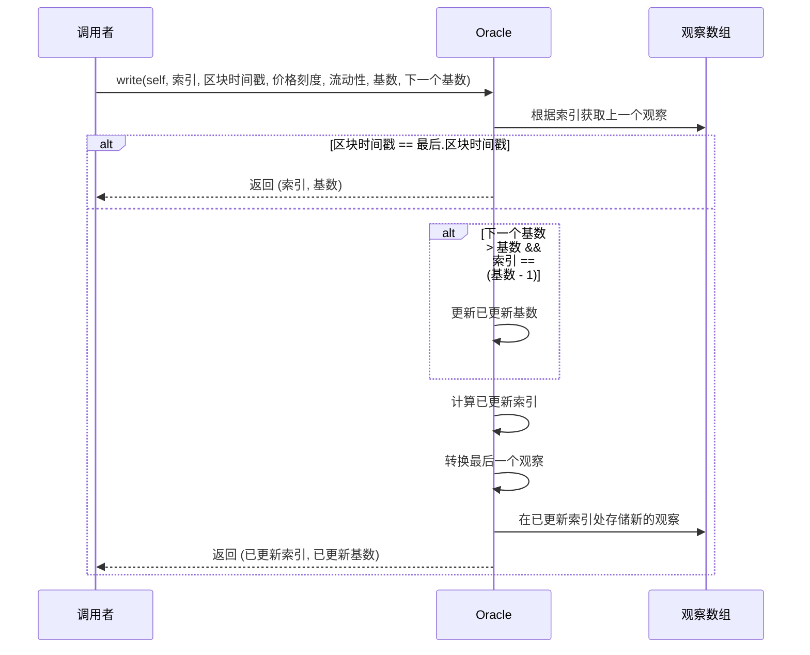

这个`write`函数是Oracle库中的一个重要函数，用于将新的观察数据写入Oracle数组。以下是其实现逻辑、原理和功能的总结：

1. 实现逻辑：
   - 首先检查是否在同一区块已经写入了观察数据，如果是，则直接返回。
   - 根据条件更新cardinality（Oracle数组的有效长度）。
   - 计算新的索引位置。
   - 使用transform函数创建新的观察数据。
   - 将新的观察数据写入Oracle数组。

2. 原理：
   - 使用循环数组的方式存储观察数据，当达到数组末尾时，会回到开头继续写入。
   - 通过cardinality和cardinalityNext参数来控制数组的实际使用长度和潜在扩展长度。
   - 利用transform函数计算新的累计值，确保数据的连续性和准确性。

3. 功能：
   - 将最新的价格和流动性数据写入Oracle数组。
   - 支持动态扩展Oracle数组的长度。
   - 防止在同一区块重复写入数据。
   - 维护Oracle数据的时间顺序和连续性。
   - 返回更新后的索引和cardinality，以便外部函数跟踪Oracle数组的状态。

4. 关键点：
   - 函数设计考虑了gas优化，例如提前返回和条件判断。
   - 使用模运算来实现循环数组，有效利用存储空间。
   - 通过参数传递当前状态，使得函数可以在不同的上下文中使用。

总的来说，这个`write`函数是Oracle系统的核心组件，负责维护和更新价格和流动性的历史数据，为其他功能（如价格预言机）提供基础数据支持。