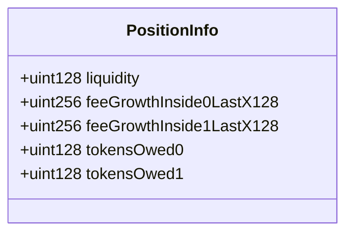

这段代码展示了Uniswap V3中Position库的实现，用于管理用户在特定价格范围内的流动性位置。让我们逐一解析Info结构中的每个字段及其设计意义：

1. liquidity (uint128):
   - 含义：该用户在此位置提供的流动性数量。
   - 目的：用于计算用户应得的手续费和份额。

2. feeGrowthInside0LastX128 (uint256):
   - 含义：上次更新时，位置范围内token0的每单位流动性累积手续费增长。
   - 目的：用于计算用户应得的token0手续费。

3. feeGrowthInside1LastX128 (uint256):
   - 含义：上次更新时，位置范围内token1的每单位流动性累积手续费增长。
   - 目的：用于计算用户应得的token1手续费。

4. tokensOwed0 (uint128):
   - 含义：用户在token0中应得的累积手续费。
   - 目的：记录用户可提取的token0手续费。

5. tokensOwed1 (uint128):
   - 含义：用户在token1中应得的累积手续费。
   - 目的：记录用户可提取的token1手续费。

高效计算和累积用户应得手续费的方法：

1. 延迟计算：不是每次交易都更新用户的应得手续费，而是在用户添加、移除流动性或提取手续费时才进行计算。

2. 全局累积值：使用全局的feeGrowthInside0X128和feeGrowthInside1X128来记录累积的手续费增长。

3. 差值计算：通过当前全局累积值与上次更新时的值之差，乘以用户的流动性，得到用户这段时间应得的手续费。

4. 存储优化：只存储必要的信息（如liquidity和上次更新时的feeGrowth），而不是每次都存储具体的手续费金额。

这种设计可以显著减少gas消耗，因为：

1. 减少了存储操作：不需要频繁更新每个用户的具体手续费。
2. 批量计算：可以一次性计算长时间内累积的手续费。
3. 按需更新：只在必要时（如用户操作时）才进行更新，避免了冗余计算。

总之，这种设计通过延迟计算和全局累积值的方式，在保证准确性的同时，大大提高了效率并降低了gas消耗。