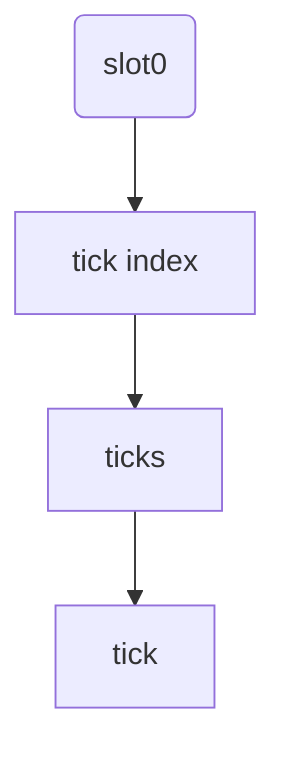
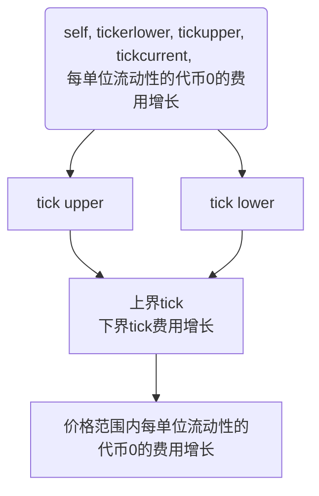

# Get tick

```mermaid
graph TD
    C(slot0)
    C -->D[tick index]
    D --> E[ticks]
    E --> F[tick]
```

# Get Fee Inside

```mermaid
graph TD
    C(self, tickerlower, tickupper, tickcurrent, <br>每单位流动性的代币0的费用增长)
    C -->D[tick upper]
    C -->H[tick lower]
    D --> E[上界tick<br>下界tick费用增长]
    H --> E
    E --> F[价格范围内每单位流动性的代币0的费用增长]
```
