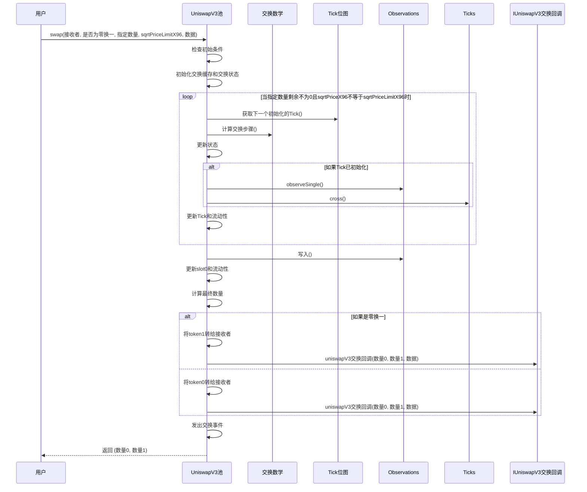

```mermaid
sequenceDiagram
    participant 用户
    participant UniswapV3池
    participant 交换数学
    participant Tick位图
    participant Observations
    participant Ticks
    participant IUniswapV3交换回调

    用户->>UniswapV3池: swap(接收者, 是否为零换一, 指定数量, sqrtPriceLimitX96, 数据)
    UniswapV3池->>UniswapV3池: 检查初始条件
    UniswapV3池->>UniswapV3池: 初始化交换缓存和交换状态
    loop 当指定数量剩余不为0且sqrtPriceX96不等于sqrtPriceLimitX96时
        UniswapV3池->>Tick位图: 获取下一个初始化的Tick()
        UniswapV3池->>交换数学: 计算交换步骤()
        UniswapV3池->>UniswapV3池: 更新状态
        alt 如果Tick已初始化
            UniswapV3池->>Observations: observeSingle()
            UniswapV3池->>Ticks: cross()
        end
        UniswapV3池->>UniswapV3池: 更新Tick和流动性
    end
    UniswapV3池->>Observations: 写入()
    UniswapV3池->>UniswapV3池: 更新slot0和流动性
    UniswapV3池->>UniswapV3池: 计算最终数量
    alt 如果是零换一
        UniswapV3池->>UniswapV3池: 将token1转给接收者
        UniswapV3池->>IUniswapV3交换回调: uniswapV3交换回调(数量0, 数量1, 数据)
    else
        UniswapV3池->>UniswapV3池: 将token0转给接收者
        UniswapV3池->>IUniswapV3交换回调: uniswapV3交换回调(数量0, 数量1, 数据)
    end
    UniswapV3池->>UniswapV3池: 发出交换事件
    UniswapV3池-->>用户: 返回 (数量0, 数量1)
```